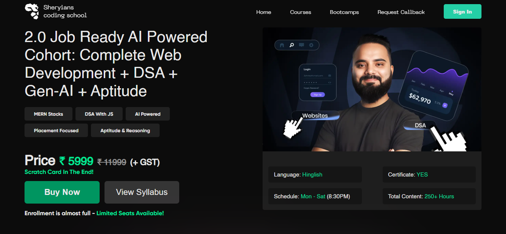
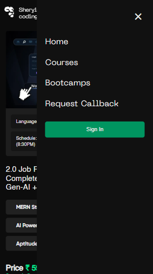

# Sheryians Website Clone

This is a **student practice project** inspired by Sheryians website, built as a clone using **HTML, CSS, and JavaScript**. 

## Features
- Fully responsive layout
- Mobile-friendly navigation menu
- Interactive buttons with hover effects
- Custom fonts and modern UI

## Technologies Used
- HTML5
- CSS3
- JavaScript (Vanilla)
- Git & GitHub

## Folder Structure
sheryians-clone/
├── assets/
│ ├── fonts/
│ └── screenshots/
├── index.html
├── style.css
└── script.js

## Screenshots
### Desktop View

### Hero View

### Mobile Menu

## How to Run
1. Clone the repository: `git clone https://github.com/kenil948/sheryians-clone.git`
2. Open `index.html` in your browser

## Live Demo
Check it out here: [Sheryians Clone](https://kenil948.github.io/sheryians-clone/)

## Notes
This is a **student practice project** and **not an official Sheryians website**.

## What I Learned
- Folder structuring in GitHub
- Cloning UI from existing websites
- Better understanding of CSS layouting
- Using Git & GitHub confidently
- Improving responsive design skills
